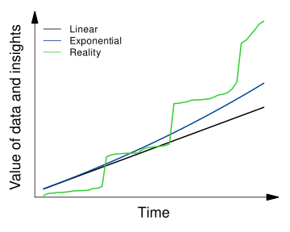

Good data pay compound interests
===
Jitao David Zhang, February 2024

A simple graphics that hopefully makes the point.

Technically, the Rmd file contains a snippet on making a base R plot with 2D axes only below and to the left of the figure, with arrowheads pointing the direction of positive values.

